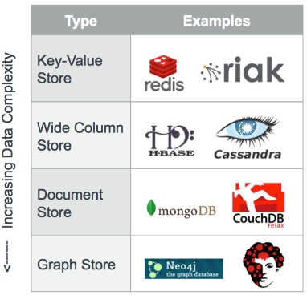
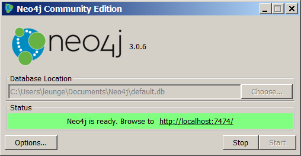
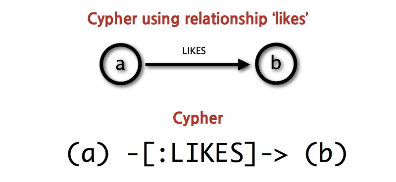
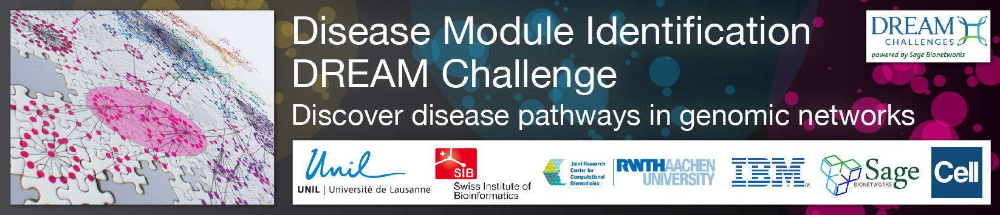
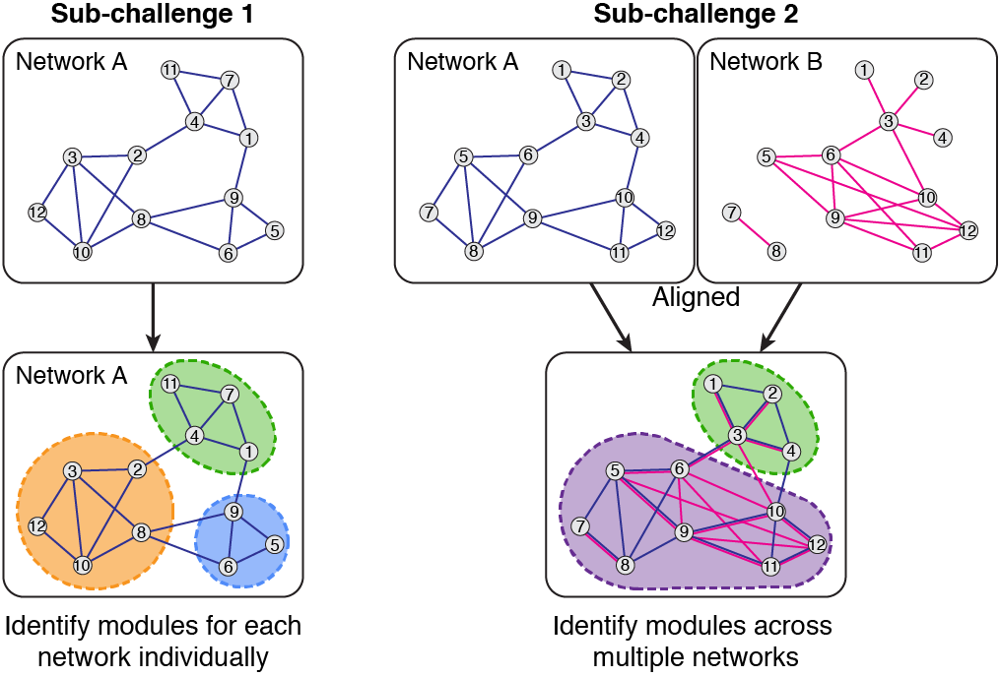

```{r setup, include=FALSE}
knitr::opts_chunk$set(echo = FALSE)
```

## What are Databases?

**Databases** are organized collections of data.

**Relational databases** are where data are stored in spreadsheet-like
structures.


## We Use Query Languages to Ask Databases for Data

The query language for relational databases is **SQL**, or Structured Query
Language.

```sql
SELECT *
FROM  Book
WHERE price > 100.00
ORDER BY title;
```


## Spread of NoSQL Databases

Different non-spreadsheet-like databases structures are becoming popular.

These are collectively known as **NoSQL databases**.




## What is Neo4j?

> "Neo4j is a highly scalable, native graph database purpose-built to leverage
> not only data but also its relationships."


### Features

- NoSQL graph database
- Uses Cypher query language instead of SQL
- Native property graph model
- Flexible schema


## How to Install Neo4j

### GUI Version

Visit https://neo4j.com/download/

Click on "Download Community Edition"

**Note**: Windows, Linux, and Mac friendly

### Command Line Version

Use Homebrew

```shell
brew install neo4j
```


## How to Start Neo4j


## How to Start Neo4j




## How to Use Neo4j

### Use Neo4j's native graph query language, Cypher

### Use REST API

- For R: `RNeo4j`
- For Python: `py2neo`
- Also available for Java, Ruby, PHP, and others


## Cypher Query Language

Similar to SQL language

"Nodes" are surrounded by parentheses

Arrows (`-->`) represent (directed) relationships




## Cypher Query Language

Clauses are chained together like pipes

Common commands:

- `MATCH`: graph pattern to match
- `WHERE`: constraints
- `RETURN`: what you want to return

Example:

```cypher
MATCH (user)-[:friend]->(follower)
WHERE user.name IN ['Joe', 'John', 'Sara', 'Maria', 'Steve']
    AND follower.name =~ 'S.*'
RETURN user.name, follower.name
```


## What are the DREAM Challenges?

> "DREAM Challenges pose fundamental questions about systems biology and
> translational medicine."


>


### DREAM Acronym

**D**ialogue for **R**everse **E**ngineering **A**ssessment and
**M**ethods


## Disease Module Identification



Module - A set of standardized parts or independent units used to construct a more complex structure

### Sub-Challenges

1. Module identification for individual networks
2. Module identification across multiple networks


## Why is Module detection important?

### 1. Reveal underlying properties of complex networks
### 3. How networks evolve and how components interact

### In This Case

1. Assessment of biological relevance of modules for genomic pathways
2. Pre-annotated functional gene sets still largely incomplete and biased towards well-studied pathways.


## Disease Module Identification



## Resources

### Cypher Query Language

- "What is Cypher" in Neo4j Manual http://neo4j.com/docs/developer-manual/current/cypher/
- Neo4j Cypher Cheatsheet http://neo4j.com/docs/2.2.5/cypher-refcard/
- Neo4j GraphGists https://neo4j.com/graphgists/

### Neo4j Developer Resources

- Neo4j from R https://neo4j.com/developer/r/
- Neo4j from Python https://neo4j.com/developer/python/
- Other languages https://neo4j.com/developer/language-guides/